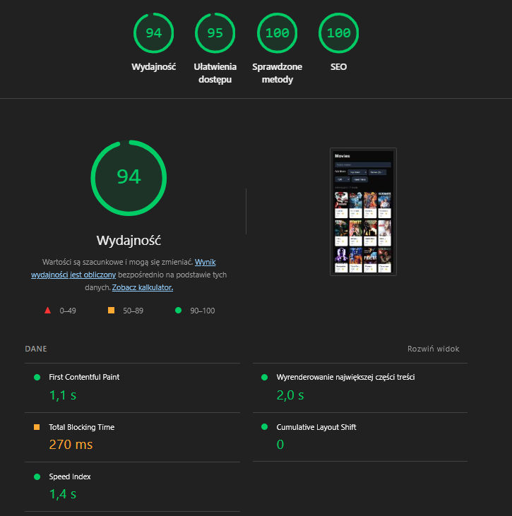

# 🎬 Reelhub

A movie browser built with Next.js and TypeScript, powered by the [TMDB API](https://www.themoviedb.org/).
Browse, filter, search and sort through movies with a clean, accessible UI.

> **Status:** ready for review  
> **Live demo:** [reelhub-five.vercel.app](https://reelhub-five.vercel.app/)

---

## 📑 Table of contents

- [Tech stack](#-tech-stack)
- [Getting started](#-getting-started)
  - [Prerequisites](#prerequisites)
  - [Setup](#setup)
- [Available scripts](#-available-scripts)
- [Project structure](#-project-structure)
- [Architecture decisions](#-architecture-decisions)
- [Accessibility](#-accessibility)
- [Testing](#-testing)
- [Roadmap](#-roadmap)
- [Attribution](#-attribution)

---

## 🛠 Tech stack

- **Framework:** [Next.js 15](https://nextjs.org/) (App Router) + [React 19](https://react.dev/)
- **Language:** [TypeScript](https://www.typescriptlang.org/) (strict mode)
- **Styling:** [Tailwind CSS](https://tailwindcss.com/)
- **Data fetching:** [TanStack Query](https://tanstack.com/query/)
- **API:** [The Movie Database (TMDB)](https://www.themoviedb.org/documentation/api)
- **Validation:** [Zod](https://zod.dev/)
- **Deployment:** [Vercel](https://vercel.com/)
- **Testing:** [Vitest](https://vitest.dev/)

## 🚀 Getting started

### Prerequisites

- Node.js 20+
- npm
- A TMDB API token ([how to get one](https://developer.themoviedb.org/reference/intro/getting-started))

### Setup

```bash
# 1. Clone the repository
git clone https://github.com/YOUR_USERNAME/reelhub.git
cd reelhub

# 2. Install dependencies
npm install

# 3. Set up environment variables
cp .env.example .env.local
# Then edit .env.local and add your TMDB token

# 4. Start the dev server
npm run dev
```

Open [http://localhost:3000](http://localhost:3000) in your browser.

## 📜 Available scripts

| Script                 | Description                             |
| ---------------------- | --------------------------------------- |
| `npm run dev`          | Start the dev server (with Turbopack)   |
| `npm run build`        | Build for production                    |
| `npm run start`        | Run the production build                |
| `npm run lint`         | Run ESLint                              |
| `npm run format`       | Format all files with Prettier          |
| `npm run format:check` | Check formatting without changing files |
| `npm run test`         | Run tests in watch mode                 |
| `npm run test:run`     | Run tests once (CI)                     |

## 📁 Project structure

```
src/
├── app/                        # routes, layouts
│   ├── api/
│   │   └── movies/             # Route Handler (TMDB proxy)
│   └── movies/
│       ├── [id]/               # Movie detail page
│       └── page.tsx            # Movies list
├── features/                   # feature-based modules
│   └── movies/
│       ├── api/                # TMDB client and query
│       ├── components/         # movie UI components
│       ├── hooks/              # custom hooks
│       └── types/              # domain types
└── shared/                     # shared components
    ├── ui/                     # UI reusable components
    └── lib/                    # utilities, env config

```

## 🏛 Architecture decisions

### URL-based filter state

Search filters live in URL search params instead of local React state. This makes filters shareable via link, preserves browser back/forward navigation, and gives the app a single source of truth — the URL.

TanStack Query picks up param changes through its query key. Rapidly changing filters (e.g. while typing) automatically cancel previous in-flight requests, so I don't need to wire AbortControllers manually.

**Trade-off:** slightly more hook complexity than a simple `useState`.

### Feature-based folder structure

Repository is organised by feature rather than by type. Everything related to movies lives in one place — easier to navigate.

**Trade-off:** shared components require discipline about what goes into `shared/` vs stays in the feature folder.

### Typed API layer with snake_case → camelCase mapping

TMDB API returns data in snake_case, while the app internally uses camelCase. I added a dedicated mapping layer (`mapMovie`, `mapMovieDetail`) to transform raw API responses into typed domain models.

### Client-side caching with TanStack Query

Movie list fetching uses TanStack Query instead of direct server-side rendering. This improves user experience — if a user returns to already visited filters, results appear instantly without a new request to the API. TMDB data does not update frequently, which makes client-side caching a good fit here.

`keepPreviousData` keeps previous results visible (slightly dimmed) while new data loads, eliminating layout shifts during filter changes.

**Trade-off:** MoviesPage became a Client Component, requiring a `/api/movies` Route Handler to proxy TMDB requests and keep the API token server-side.

---

## ♿ Accessibility

Audited with Lighthouse on production build.



| Category       | Score |
| -------------- | ----- |
| Performance    | 94    |
| Accessibility  | 95    |
| Best Practices | 100   |
| SEO            | 100   |

## 🧪 Testing

Tests cover three layers of the application:

- **API layer**
- **UI layer**
- **Hook layer**

[tests/README.md](./tests/README.md) for more details.

```bash
npm run test:run
```

## 📌 Roadmap

- [x] Project scaffolding
- [x] TMDB API client with auth and error handling
- [x] Movie list page with server-side rendering
- [x] URL-synced filters (genre, sort, search)
- [x] Pagination
- [x] Movie detail page
- [x] Unit tests
- [x] Accessibility audit
- [x] UI polish
- [x] Client-side caching with TanStack Query
- [x] Deployment to Vercel

---

## 🙏 Attribution

This product uses the TMDB API but is not endorsed or certified by TMDB.

